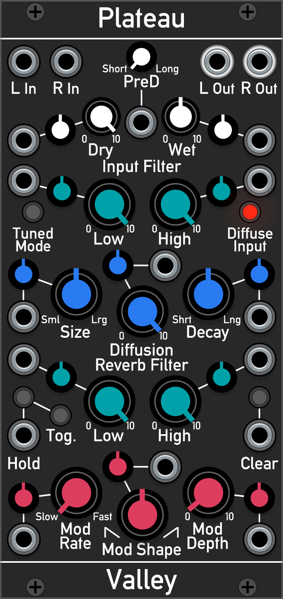

Plateau
=======

Modulateable Lush Plate Reverb
-----------------

Plateau is a plate reverb module based on the famous, Dattorro (1997)
design, and is designed to make a dry, lifeless patch sound lush, deep
and spacious. However, unlike other reverberators, Plateau attempts to
go beyond, providing a wide variety of control combinations and options.

Contents
--------

-   [User Guide](#userGuide)
-   [How it works](#howItWorks)
-   [Video Demos](#videoDemos)
-   [Bibliography](#bibliography)

User Guide {#userGuide}
----------

All of the controls on Plateau have CV inputs available allowing for
full automation of all parameters.

### Knobs

-   **Dry & Wet:** Control the levels of the original and reverberant
    signals.
-   **PreD:** Pre-delay. Determines the delay for when the original
    signal is fed into the reveberator. Ranges from 0 to 500ms.
-   **Low and High:** Input and reverberator filters.
-   **Size:** Sets the overall delay time and apparent \'size\' of the
    reverb. Ranges from very short to extremely long.
-   **Diffusion:** Controls how diffused and smeared the reverb is. No
    diffusion results in audible echoes.
-   **Decay:** Sets the speed at which the signal decays over time. The
    maximum setting results in a long reverb that evolves over time into
    a very slowly dying cloud of sound.
-   **Diffuse Input:** Enages the input diffusion stage that
    pre-diffuses and smears the signal before reverberation. Bypassing
    the stage sharpens the input signal.
-   **Tuned Mode:** Shortens the delay times and tunes the all-pass
    filters to 1V/Oct so that the reverb can be \'played\'.

### Buttons

-   **Hold:** Sets the decay of the reverb to infinite so that it will
    continuously reverberate.
-   **Tog:** Sets the \'Hold\' switch to be either toggled or momentary
-   **Clear:** Purges the reverberator. Useful for creating gated reverb
    effects, or diminshing complete chaos.

How it works {#howItWorks}
------------

Plateau is based upon the popular Dattorro (1997) digital plate reverb
design. The flow diagram below shows a simplified version of the
algorithm.

The audio is initially pre-delayed and equalised before passing through
the \'Input Diffuser\' which smears and diffuses the signal. In Plateau,
there is the option to bypass this stage.

Next, the diffused signal is passed into the \'Reverberation Tank\'
which is two chains of filters arranged in parallel. The chains are fed
into each other to continuously diffuse the signal and build up a dense
reverberation. The reverb decays over time thanks to the equalisation
and decay stages after each chain. The left and right output signals are
extracted from this tank at several tap points (not shown).

Dattorro (1997) found that unpleasant ringing can build up over time. To
combat this, the delay times of the all-pass filters in the tank are
subtly modulated by low frequency oscillators (LFOs). This modulation
changes the resonant frequency of the reverberator over-time to supress
the ringing. This also slowly changes the reflection pattern so that it
appears to continuously vary. With moderate modulation, this results in
an audible pitch shifting.

Video Demos {#videoDemos}
-----------

[Omri Cohen](https://www.youtube.com/channel/UCuWKHSHTHMV_nVSeNH4gYAg)
gives a nice introductory tutorial for Plateau.

Martin of [ML\_Modules](https://github.com/martin-lueders/ML_modules)
composed this beautiful, ambient patch that presents the lush reverb
that can be easily achieved.

[Finetales](https://www.youtube.com/channel/UCvko3sGxewyzT58qJAJkVMA)
demos the dreaminess that Plateau can add to a simple synth patch.

Artem from [VCV Rack Ideas](https://www.instagram.com/vcvrackideas/)
showcases some unusual and alternative uses of Plateau, demonstrating
that it is not just another reverb.

Bibliography
------------

Dattorro, J. (1997). Effect design part 1: Reverberator and other
filters, *J. Audio Eng. Soc, 45*(9), 660-684.
