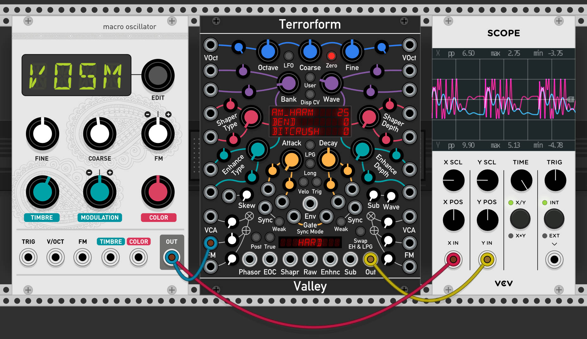

# Terrorform

## **A complex, shapeable, bendable, customisable wavetable voice.**

Version 1.1.0, &copy; 2020 Dale Johnson

## Contents
<!-- TOC depthFrom:1 depthTo:6 withLinks:1 updateOnSave:0 orderedList:0 -->

- [Description](#description)
- [Features](#features)
- [A word from the developer](#a-word-from-the-developer)
    - [Some trivia](#some-trivia)
- [The Controls](#the-controls)
    - [Context menu](#-context-menu)
- [Usage](#usage)
    - [Waves](#waves)
    - [Phasor Shaper](#phasor-shaper)
    - [Enhancer](#enhancer)
    - [Lowpass Gate (LPG)](#lowpass-gate-lpg)
	- [LFO Mode](#lfo-mode)
	- [Zero Frequency](#zero-frequency)
		- [Use 1: Leader-Follower](#use-1-leader-follower)
		- [Use 2: Complex Waveshaper](#use-2-complex-waveshaper)
- [The User Wavetable Manager](#the-user-wavetable-manager)
	- [Loading, viewing, and deleting](#loading-viewing-and-deleting)
- [Appendix A: How it works](#appendix-a-how-it-works)

<!-- /TOC -->

## Description

Terrorform is a shapeshifting, voltage controlled, wavetable synthesis voice that focuses on the efficient exploration and discovery of new timbres. It is a derivative of the core oscillator code from the Dexter module, but with many enhancements that allow it to be its own, independent module. Terrorform is not solely an oscillator, as with the addition of the lowpass gate (LPG) it can become a basic synth voice or percussive source.

## Features

* 16 voice polyphony
* 64 banks of built-in wavetables.
* User wavetable bank loading with up to 64 slots.
* 27 wavetable shaper modes.
* 11 output enhancement modes.
* 16 synchronisation modes.
* 2x2 FM inputs with VCAs.
* Both "DX style phase mod" and "True" modes for different frequency modulation flavours.
* Velocity sensitive Lowpass Gate (LPG) with programmable attack and decay.
* "Zero" frequency mode that turns the module into a waveshaper via its FM inputs.
* "LFO" mode
* Text based tooltips

## A word from the developer

I find it quite crazy to believe that it has been nearly 3 years since I began developing third party modules for VCV Rack. When a friend showed me program, I was stunned. My first question was "Can I develop for this?", and we of course know the answer to that!

This module took much longer than I had originally anticipated. I initially thought it would have been a simplification of my beastly FM module, Dexter, by isolating a single operator. However, like most things, it is never that simple. When I did isolate an operator from Dexter, I felt that it was just too simple, and so I decided to  add a wave-shaper (dubbed the _Enhancer_), a Low-pass gate, and (most importantly for me) the ability to add your own wavetables. I find it amusing that back in September of 2019 I had completed most of the audio processing work, and thought that the user wavetable manager would be simple...

I never learn do I, ha!

Anyway, without further introduction, I present to you _Terrorform_.

Happy Racking!
Dale, Valley Audio Soft

### Some trivia

The name _Terrorform_ is a reference to two things.

First, it is a play on the word _terraforming_, which is a hypothetical process of modifying the landscape, oceans, and atmosphere of a planet in order to make it habitable for life. This is essentially what you are doing in Terrorform: sculpting and shaping the sound from a base wave to create something new.

Second, it is a reference to the British sci-fi sitcom "Red Dwarf", and is named after the episode "Terrorform". In the episode, the "beloved" hologram Rimmer is taken prisoner by manifestations of his own mind on a shapeshifting psy-moon.

To quote the episode:

_Kryten : "I remember Mr Rimmer screaming. I have an image of his face, twisted with fear, pain, anguish, dread.
Absolutely mortified."_

_The Cat : "Did someone suggest that he pick up the tab for lunch?"_

I felt the name was very fitting. The sounds I have twisted out of this module can be astonishing and beautiful, but can also be the stuff of nightmares.

## The Controls

Terrorform's controls can be split up into several parts (see below):

The display in the centre of Terrorform indicates the setting of the Wavetable, Phasor Shaping, and Enhancer modes, yet, however, it is more than a display. Hovering your mouse cursor over the display and clicking on one of the three rows will open a drop-down for that setting. For example, clicking on the wavetable row will open the the bank selection menu, with all 64 banks sorted into 4 groups of 16 banks (see below).

### Context menu

The context, or right-click, menu contains extra features that alter the appearance and operation or Terrorform. As with any other Rack module, this menu is accessed by right-clicking in any empty area of the module. The menu contains the following options:

* **User Bank manager**
  - **Open:** Clicking this will open the user bank manager and allow you to load your own wavetable banks into Terrorform (see the _The User Wavetable Manager_ section).
* **Output level**
  - **Reduce the level by 6 dB:** Cuts the main output signal by half, which is useful if connecting this module directly to a filter that is sensitive to being overdriven.
* **Display style:** Set the colour of the digital display menus
  - Red
  - Yellow
  - Green
  - Blue
  - White
* **Panel style:** Change the style of the front panel
  - Dark
  - Light

## Usage

In normal operation, the tuning of Terrorform is set using the blue pitch controls at the very top, and is offset using the sum of the two VOct inputs. The read phasor shaping is set using the _Shape Type_ and _Shape Depth_ knobs, and the output waveform is further enhanced by the _Enhancer_. The mode and depth of the _Enhancer_ is set by the _Enhancer Type_ and _Enhancer Depth_ knobs.

### Waves

As name of the module implies, the sound is _terraformed_ using wavetable synthesis. Wavetable synthesis is a tone generation method that is used to generate more complex waveforms than the typical Sine, Triangle, Sawtooth and Pulse waveforms found on most synthesizers. In this method, a tone is generated by reading back the contents of a pre-generated table of complex waveforms using a rising ramp wave, or _phasor_. This is the beating heart of the module. To create evolving tones and add movement to the sound, the table is continuously scanned or, essentially, cross-faded between adjacent waves in the table.

In Terrorform, there are 64 built-in wavetable banks, each with their own timbral characteristics. These are are set by the _Bank_ and _Wave_ knobs, where _Bank_ selects which wavetable bank to accessed, and _Wave_ scans through the wavetable itself.

### Phasor Shaper

To add more _flavour_ and variation to the waveform, the wavetable read phasor can be shaped in many different ways. The shaping type is set by _Shape Type_, and the depth is set by _Shape Depth_. The following table lists and describes each mode of the phasor shaper:

|Mode|Description|
|---|---|
|Bend|The phasor is dragged to one side from the middle so that the 1st half of the table is read faster than the last half|
|Tilt|The phasor reads the table faster and then waits at the end until a new cycle begins|
|Lean|The phasor follows a curve, so the table is initial read slowly then gradually faster towards the end of the cycle|
|Twist|Twists the middle third of the phasor around the centre, making read the table forwards, backwards, then forwards again|
|Wrap|The end of the phasor is wrapped back to the beginning several times, creating an effect similar to classic hard sync|
|Sine Wrap|Like Mirror, but the phasor is passed through a sine function, thus giving a gentler sound|
|Mirror|Both ends of the phasor are mirrored when either reaches the start or end|
|Harmonics|Like Sine Wrap, but with cross-fading between fixed sine harmonics|
|Warble|The phasor is randomly wobbled backwards and forwards, giving a _warbling_ effect|
|Reflect|At a given point, the phasor is switched from an rising ramp to a falling ramp|
|Pulse|The phasor is _switched off_ an on at several positions, giving a type of PWM effect|
|Step 4|Blends the phasor into a 4-step staircase, creating a very lo-fi, bit crushed sound|
|Step 8|Blends the phasor into an 8-step staircase, creating a very lo-fi, bit crushed sound|
|Step 16|Blends the phasor into a 16-step staircase, creating a very lo-fi, bit crushed sound|
|Var Step|Gradually makes the phasor increasingly stepped until it disappears completely|
|Buzz|The phasor is cloned from within itself from the middle, resulting in a _buzzy_ texture|
|Buzz X2|Like previous but the phasor is cloned twice|
|Buzz X4|Like previous but cloned four times|
|Wrinkle|A derivative of Buzz, but with a sine function applied, resulting in a bell like tone|
|Wrinkle X2|Like previous but the phasor is cloned twice|
|Wrinkle X4|Like previous but the phasor is cloned four times|
|Sine Up|A derivative of Wrinkle, but with a fade **down** function applied, resulting in a vocal / nasal like tone which is dependent on the wavetable|
|Sine Up X2|Like previous but the phasor is cloned twice|
|Sine Up X4|Like previous but the phasor is cloned four times|
|Sine Down|A derivative of Wrinkle, but with a fade **up** function applied, resulting in a vocal / nasal like tone which is dependent on the wavetable|
|Sine Down X2|Like previous but the phasor is cloned twice|
|Sine Down X4|Like previous but the phasor is cloned four times|

### Enhancer

Once the wavetable has been read, the generated a waveform can be even further enhanced. The enhancer is essentially a waveshaper. This is different from phasor shaping which affects how the wavetable is read, but instead this _shapes_ the resulting output waveform after the table has been read. The following table lists and describes each mode of the enhancer:

| Mode | Description | Param |
|---|---|---|
|Bitcrush|Downsamples the wave to achieve a lo-fi, crunchy timbre|Sets the down-sampling frequency|
|Quantize|Creates steps in the wave, creating a dusty, old-school texture|Controls the distance between steps|
|AND Int|Integer AND's the bits of the wave with the bits of the read phasor|Mixes between the clean and ANDed signal|
|XOR Int|Integer XOR's the bits of the wave with the bits of the read phasor|Mixes between the clean and XORed signal|
|AND Float|Floating-point AND's the bits of the wave with the bits of the read phasor|Mixes between the clean and ANDed signal|
|Overdrive|Adds some harmonic content to the wave by passing it through a hyperbolic tangent function|Controls the amount of overdrive|
|Ring Mod|Multiplies the wave with a carrier sine wave derived from the read phasor|Sets the carrier sine wave frequency|
|Sharpen|Multiplies the wave against itself to sharpen the peaks in the wave|Degree of sharpness|
|Sine|Passes the wave through a sine function, much like a Chebyshev waveshaper, creating an FM-like timbre|Amount of waveshaping|
|Fold|Classic wavefolding that folds the wave back upon itself when it reaches a limit|Degree of folding|
|Mirror|Like wavefolding except the waveform reappears at from the opposite voltage _rail_. Crossfading is applied to soften this effect as it can otherwise sound too aggressive|Degree of mirroring|

When the LPG is enabled, in its default state the signal chain is **Wavetable Reader > Enhancer > Lowpass Gate**. However, by enabling the "Swap EH & LPG" button, the order can be switched to **Wavetable Reader > Lowpass Gate > Enhancer**.

### Lowpass Gate (LPG)

The LPG is enabled / disabled by holding down the "LPG" button for more than 0.5 seconds. There are three modes for the LPG: VCA, Filter, and Filter + VCA. These are cycled through by clicking the LPG button. Each mode is indicated by a colour:

| Colour | Mode |
|---|---|
|Red|VCA|
|Green|Filter|
|Blue|Filter + VCA|

The LPG is controlled by an envelope that can be gated by gate signals received at the "Gate" inputs. Like your traditional A/D envelope, the envelope goes into the attack phase when the gate is high (> 0v), and then decay phase when low (<= 0v). If whilst the envelope is in its attack phase and the gate goes low, the envelope immediately enters the decay phase.

If your gates are short, e.g. are 1ms long trigger signals, and you have a slow attack, then the envelope amplitude will be too weak for the signal to be audible. The solution for this is to toggle the "Trig" button, which puts the envelope into a re-triggerable, one-shot mode. In this mode, the envelope will complete one cycle when it receives a trigger signal at the "Gate" inputs, regardless of the length of the signal. However, because this mode is re-triggerable, the envelope will immediately restart its attack phase when receiving subsequent trigger signals, regardless of what phase or the progress of the envelope.

The attack and decay of the envelope is set by the respective "Attack" and "Decay" knobs that flank the LPG button. Toggling the "Long" button extends the attack / decay time range. Velocity sensitivity is enabled by toggling the "Velo." button. The sum of the voltages at the gate inputs determines the overall amplitude of the envelope, thus either affecting the loudness or the brightness of the LPG. This is useful for adding dynamics when creating percussive sounds with Terrorform.

### Sync

Synchronisation, or sync for short, is a method of forcing an oscillator to reset so that match its pitch to another oscillator. This is usually achieved by sending a pulse or other zero-crossing signal from source oscillator into the a special sync input on the target oscillator. When a new pulse is detected, known as a _sync event_, the target oscillator resets. This usually results in buzzy overtones depending on the type of synchronisation (the reset method described is known as hard sync). Terrorform features 16 synchronisation types.

The following table describes what happens to the read phasor upon detection of a sync event.

| Mode | Description
|---|---|
|Hard|Resets to the beginning of cycle|
|Fifth|Cause the read speed to switch between 1x and 1.5x, or between root pitch and fifth above root pitch|
|+1 Octave|Cause the read speed to switch between 1x and 2x, or between root pitch and 1 octave _above_ root pitch|
|-1 Octave|Cause the read speed to switch between 1x and 0.5x, or between root pitch and 1 octave _below_ root pitch|
|Rise 1|A value of 0.5 is added to the read speed until it reaches 2x, where it after it will return to 1x|
|Rise 2|A value of 0.5 is added to the read speed until it reaches 4x, where it after it will return to 1x|
|Fall 1|Same as Rise 1 but in reverse|
|Fall 2|Same as Rise 2 but in reverse|
|Pull 1|Is pulled back by 1/2 a cycle|
|Pull 2|Is pulled back by 1/4 a cycle|
|Push 1|Is pushed back by 1/4 a cycle|
|Push 2|Is pushed back by 1/2 a cycle|
|Hold|Cause the phasor to hold its current position and wait until another sync event is detected|
|One Shot|The phasor will run for only one cycle on each sync event. Any subsequent event will reset the phasor and run for one cycle again|
|Lock Shot|Similar to one-shot, except subsequent sync events are ignored until the cycle is complete|
|Reverse|Reverse the direction the phasor will accumulate|

### LFO mode

The LFO button at the top right of Terrorform puts it into low frequency mode, and turns it into a complex modulation source.

### Zero frequency

_"Zero Frequency? What's the purpose of this feature?"_ I hear you say.

The eagle eyed amongst you may have noticed one of the benefits of including the _DX style phase mod_ flavour of FM. Remember, in phase modulation, the phase of the of the read phasor is shifted, regardless of frequency. Therefore, if the frequency is zero and you shift the phase of the read phasor, you will still read the contents of the wavetable but with an external source. When this feature is enabled, the read phasor is _parked_ at the beginning of the wavetable so that no hidden phase offset is introduced.

The following two sub-sections discuss example uses for this feature.

#### Example 1: Leader-Follower

Zero frequency allows you to drive a _follower_ Terrorform module in _phase mod_ mode with a _leader_ Terrorform. First, put the _follower_ Terrorform into _Zero Frequency_ mode by pressing the _Zero_ button, and ensure that the _True FM_ button is off (i.e _DX Style Phase Mod_ mode). Then, connect the _Phasor Output_ from the leader Terrorform (not in Zero Frequency mode) into an FM input of the _follower_ and turn up the FM input's attenuator (see following screenshot). You will begin to hear a sound as before, but the pitch is now controlled by the _leader_ module. In the _follower_, you will still have the shaping and wave enhancement features, but also have perfect pitch and phase matched signals between both modules. You can drive as many Terrorform modules as you want using one or more leaders and their phasor outputs connected to the followers FM inputs.

#### Example 2: Complex Waveshaper

Zero frequency is not limited to letting you drive Terrorforms with other Terrorform. As long as any signal, either AC or DC, is connected to the FM input whilst in _DX Style Phase Mod_ mode, the wavetable reading then controlled by this external signal. This turns Terrorform into a complex waveshaper, where the result is controlled by the wave, shaper, and enhancement parameters.

_Note:_ The waveshaping result will depend on the peak-to-peak voltage and voltage offset of the input signal. For optimal waveshaping, the input signal should be ±5v peak-to-peak with no offset.

## The User Wavetable Manager

Got bored of the built in tables? Want to load in your own? Terrorform lets you load up to 64 wavetable banks as .WAV files, where each bank can contain up to 64 waves that are 256 samples per cycle in length. This particular specification was chosen so that wavetables generated in the free "WaveEdit" tool from Synthesis Technology (no affiliation) could be used directly in Terrorform with no compatibility issues.

Not only can you load in wavetables banks, but the banks are saved into your patch file. This means that you do not have to load in your banks each time you re-load your patch, and it allows your patch to be portable and easily shared.

Finally, you can export and load your banks as single ROM files. These are known as Valley Wave Table files and have the file extension ".vwt". These files will allow you to swap out entire groups of banks without the need to laboriously load individual .wav files when you want to change.

Having the ability to load your own wavetables expands the timbral palette of Terrorform, and allows the you to tailor the sound to your own needs.

### Accessing and using the manager

The manager is accessed by right-clicking on Terrorform to access the context menu, and then selected "Open" under "Wavetable manager". The knobs will disappear to reveal the User Wavetable Manager menu system where you will be presented with six options (see previous). Here you can access the bank editor, 'defrag'ment the bank memory, export and load ROM files, or destroy the user bank memory entirely and start again from scratch.

 

### Loading, viewing, and deleting

Wavetable banks are loaded into the module as a single channel .WAV file. The waveforms should be arranged in the .WAV file to appear continuously, one after another in 256 sample long blocks. In other words, one cycle of a wave in your bank should be 256 samples long.

Up to 64 waves can be your .WAV file, bringing the total length of the file to 16,384 samples.

To load a file into a bank slot, starting from the Manager main menu, go to Edit, pick an empty slot from the grid, and click the "Load" button. A file explorer should open where you can then navigate to where your .WAV file is on your computer. Once opened, you will be asked to name your bank, and be shown a visualisation of it.

 

The name can be up to 9 characters long. You can crop the bank by selecting the start and end waves from the draggable number boxes at the top. Finally, you can scrub through the wavetable using clicking and dragging the visualiser with your mouse, and inspect the individual waves with the display at the bottom.

When you are ready to finish loading, click Okay, and you will be taken back to the slot grid where you can now see your chosen slot now glowing red. You can continue adding more waves by choosing another slot and clicking on "Load" to start the process again.

### Cloning and moving

Whilst cloning a bank may seem pointless at first, where you may ask yourself "Why do I want two copies of the same bank?", but this feature allows you to crop the bank whilst cloning, allowing you to focus in on a certain section of the table without needing to load the original .WAV file.

 

To clone a bank, select it and click the "Clone" button. You will be shown a similar visualisation window as when loading a bank from a file. Here, you can view the table and select the range of waves to clone by setting draggables the start and end wave number boxes at the top.

Moving a bank is almost the same, except the bank is moved rather than cloned to its new destination. To do this, click the "Move" button. Unlike cloning you cannot crop the waveform, so you will only be shown the destination screen. Once selected, click "Okay", and you will be taken back to the slot grid. Clicking on 'Next' will take you to the destination screen. Here you select which destination bank you want source bank to be cloned to. Once selected, click on "Okay", and then the source will be cloned to the new destination bank.

 

### Viewing

Just want to admire your wavetables? Click on the view button! You can look at each wave in the box at the bottom by dragging vertically in the 3D wave view.

### Defragmentation

If you find that after removing, cloning, or moving around your banks has left your grid looking like Swiss cheese. Much like old hard disk drives, many data operations can leave all the stored data scattered and fragmented about the disk. Unlike hard disk drives, this does not affect the performance of Terrorform, but it may not be very aesthetically pleasing to you, and you may want to tidy up your banks.

Again, like for hard disk drives, there is a defragmentation feature built into the manager that will remove the gaps between banks and bring them all next to each other. To _defragment_ your banks, from the main menu when you first open the manager, click on "Defrag" and the process will instantaneously defragment your banks.

## Appendix A: How it works

Terrorform generates a tone using _wavetable lookup synthesis_. This is the exact same method used in each operator in Dexter. As the name suggests, the tone is generated by looking up and reading back the contents of a wavetable. The lookup process is done by a rising ramp wave, known as a read phasor, that reads the table from beginning to end at a set frequency. Different waves in a bank can be scanned through by cross fading between adjacent tables within the same bank. The read phasor can be shaped in several ways that can alter the output waveform. Terrorform offers 27 shaping modes. After being read, the resulting signal is passed through the _Enhancer_. This further shapes the signal in different ways such as bit-crushing, Chebyshev waveshaping, folding, and more.

