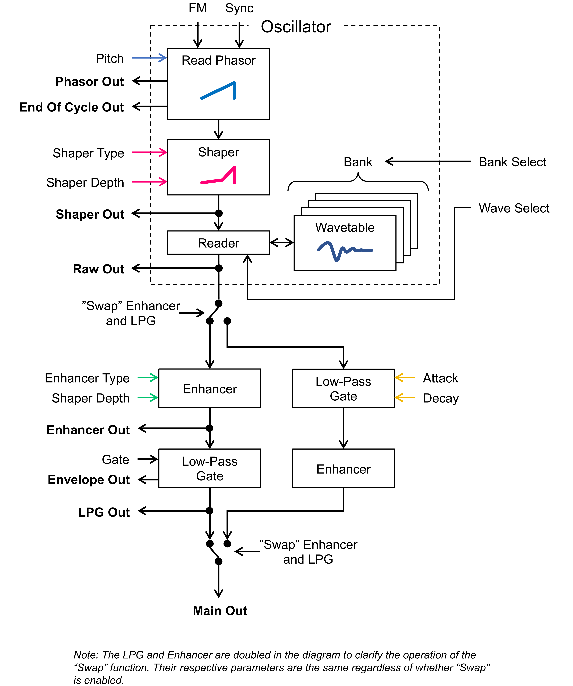

# Terrorform

**A complex, shapeable, bendable, customisable wavetable VCO.**

<!-- TOC depthFrom:1 depthTo:6 withLinks:1 updateOnSave:0 orderedList:0 -->

- [Description](#description)
    - [What's in the name?](#whats-in-the-name)
- [Features](#features)
- [The Controls](#the-controls)
- [Modes](#modes)
	- [LFO Mode](#lfo-mode)
	- [Zero Frequency](#zero-frequency)
		- [Use 1: Leader-Follower](#use-1-leader-follower)
		- [Use 2: Complex Waveshaper](#use-2-complex-waveshaper)
- [The User Wavetable Manager](#the-user-wavetable-manager)
	- [Loading, viewing, and deleting](#loading-viewing-and-deleting)

<!-- /TOC -->

## Description

_Terrorform_ is a shapeshifting, voltage controlled, wavetable oscillator that focuses on the efficient exploration
and discovery of new timbres. It is a derivative of the core oscillator code from the Dexter module, but with
many enhancements that allow it to be its own, independent module.

### What's in the name?

The name _Terrorform_ is a reference to the British sci-fi sitcom "Red Dwarf". In an episode named 'Terrorform', the "beloved"
hologram Rimmer is taken prisoner by manifestations of his own mind on a shapeshifting psy-moon.

To quote the episode:

_Kryten : "I remember Mr Rimmer screaming. I have an image of his face, twisted with fear, pain, anguish, dread.
Absolutely mortified."_

The Cat : "Did someone suggest that he pick up the tab for lunch?"_

I felt the name was very fitting. The sounds I have twisted out of this module can be astonishing and beautiful, but also completely the stuff of nightmares.

## Features

* 16 voice polyphony
* 64 banks of built-in wavetables.
* User wavetable bank loading with up to 64 slots.
* 25 wavetable shaper modes.
* 15 output enhancement modes.
* 2x2 FM inputs with VCAs.
* Both "DX style phase mod" and "True" modes for different frequency modulation flavours.
* Velocity sensitive Low-Pass Gate with programmable attack and decay.
* "Zero" frequency mode that turns the module into a waveshaper via its FM inputs.
* "LFO" mode

## The Controls

Terrorform is

## How it works

Terrorform generates a tone _lookup wavetable synthesis_. This is the exact same method used in each operator in Dexter. As the name suggests, the tone is generated by looking up and reading back the contents of a wavetable. The lookup process is done by a rising ramp wave, known as a read phasor, that reads the table from beginning to end repeatedly at a set frequency. Different Waves in bank of wavetables can be scanned through by cross fading between adjacent tables within the same bank. The read phasor can be shaped in several ways that can distort and mangle the output waveform. Terrorform offers 25 shaping modes. After being read, the resulting signal is passed through the _Enhancer_. This further shapes the signal in different ways such as bit-crushing, Chebyshev waveshaping, folding, and more.

## Modes

### LFO mode

### Zero frequency

_"Zero Frequency? What's the purpose of this feature?"_

For the eagle eyed amongst you, you may have noticed one of the benefits of including _phase mod_ style of FM. Remember, in phase modulation, the phase of the of the read phasor is shifted, regardless of frequency. Therefore, if the frequency is zero and you shift the phase of the read phasor, you instead read the contents of the wavetable with an external source. When this feature is enabled, the read phasor is _parked_ at the beginning of the wavetable.

The following two sub-sections discuss key uses for this feature.

#### Use 1: Leader-Follower

Zero frequency allows you to drive a _follower_ Terrorform module in _phase mod_ mode with a _leader_ Terrorform. First, put the _follower_ Terrorform into _Zero Frequency_ mode and set the FM mode in the context menu to _DX Style Phase Mod_. Then, connect the _Phasor Output_ from the leader Terrorform (not in Zero Frequency mode) into an FM input of the _follower_ and turn up the input's attenuator (see diagram below).

You will begin to hear a sound as before, but the pitch is now controlled by the _leader_ module. In the _follower_, you will still have the shaping and wave enhancement features, but also have perfect pitch and phase matched signals between both modules. You can drive as many Terrorform modules as you want using one or more leaders and their phasor outputs connected to the followers FM inputs.

#### Use 2: Complex Waveshaper

Zero frequency is not limited to letting you drive Terrorforms with other Terroform. As long as any signal, either AC or DC, is connected to the FM input whilst in _DX Style Phase Mod_ mode, the wavetable reading then controlled by this external signal. This turns Terrorform into a complex waveshaper, where the result is controlled by the wave, shaper, and enhancement parameters.

## The User Wavetable Manager

Got bored of the built in tables? Want to load in your own? Terrorform lets you load up to 64 wavetable banks as .WAV files, where each bank can contain up to 64 waves that are 256 samples per cycle in length. This particular specification was chosen so that wavetables generated in the free "WaveEdit" tool from Synthesis Technology (no affiliation) could be used directly in Terrorform with no compatibility issues.

Not only can you load in wavetables banks, but the banks are saved into your patch file. This means that you do not have to load in your banks each time you re-load your patch, and it allows your patch to be portable and easily shared.

Finally, you can export and load your banks as single ROM files. These are known as Valley Wave Table files and have the file extension ".vwt". These files will allow you to swap out entire groups of banks without the need to laboriously load individual .wav files when you want to change.

Having the ability to load your own wavetables expands the timbral palette of Terrorform, and allows the you to tailor the sound to your own needs.

### Accessing and using the manager

The manager is accessed by right-clicking on Terrorform to access the context menu, and then selected "Open" under "Wavetable manager". The knobs will disappear to reveal the User Wavetable Manager menu system where you will be presented with six options (see below).

Here you can access the bank editor, 'defrag'ment the bank memory, export and load ROM files, or destroy the user bank memory entirely and start again from scratch.

### Loading, viewing, and deleting

Wavetable banks are loaded into the module as a single channel .WAV file. The waveforms should be arranged in the .WAV file to appear continuously, one after another in 256 sample long blocks. In other words, one cycle of a wave in your bank should be 256 samples long.

Up to 64 waves can be your .WAV file, bringing the total length of the file to 16,384 samples.

To load a file into a bank slot, starting from the Manager main menu, go to Edit, pick an empty slot from the grid, and click the "Load" button. A file explorer should open where you can then navigate to where your .WAV file is on your computer. Once opened, you will be asked to name your bank, and be shown a visualisation of it.

 

The name can be up to 9 characters long. You can crop the bank by selecting the start and end waves from the draggable number boxes at the top. Finally, you can scrub through the wavetable using clicking and dragging the visualiser with your mouse, and inspect the individual waves with the display at the bottom.

When you are ready to finish loading, click Okay, and you will be taken back to the slot grid where you can now see your chosen slot now glowing red. You can continue adding more waves by choosing another slot and clicking on "Load" to start the process again.

### Cloning and moving

Whilst cloning a bank may seem pointless at first, where you may ask yourself "Why do I want two copies of the same bank?", but this feature allows you to crop the bank whilst cloning, allowing you to focus in on a certain section of the table without needing to load the original .WAV file.

 

To clone a bank, select it and click the "Clone" button. You will be shown a similar visualisation window as when loading a bank from a file. Here you can view the table and select the range of waves to clone by setting draggables the start and end wave number boxes at the top.

Moving a bank is almost the same, except the bank is moved rather than cloned to its new destination. To do this, click the "Move" button. Unlike cloning you cannot crop the waveform, so you will only be shown the destination screen. Once selected, click "Okay", and you will be taken back to the slot grid.

Clicking next will take you to the destination screen where can select where you want source bank to be cloned to. Once selected, click on "Okay", and then the bank will be cloned to the new destination bank.

 

### Viewing

Just want to admire your wavetables? Click on the view button! You can look at each wave in the box at the bottom by dragging vertically in the 3D wave view.

### Defragmentation

If you find that after removing, cloning, or moving around your banks has left your grid looking like Swiss cheese. Much like old hard disk drives, many data operations can leave all the stored data scattered and fragmented about the disk. Unlike hard disk drives, this does not affect the performance of Terrorform, but it may not be very aesthetically pleasing to you, and you may want to tidy up your banks.

Again, like for hard disk drives, there is a defragmentation feature built into the manager that will remove the gaps between banks and bring them all next to each other. To _defragment_ your banks, from the main menu when you first open the manager, click on "Defrag" and the process will instantaneously defragment your banks.

